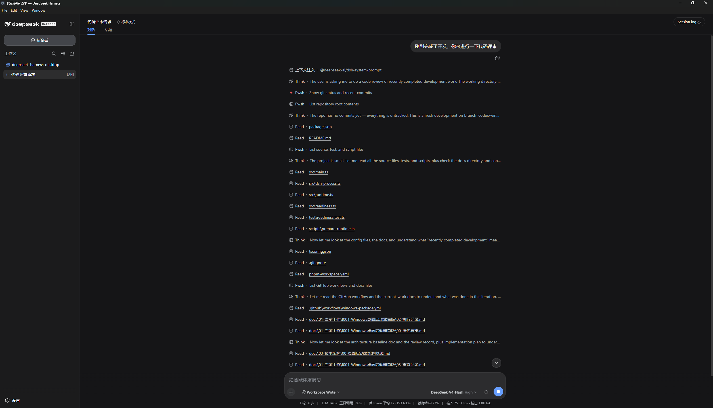
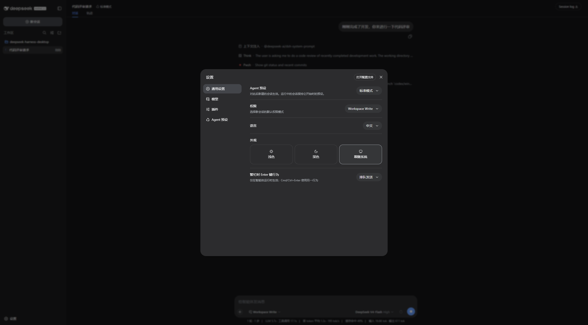

  

<h1 align="center">DeepSeek Harness Desktop</h1>

  <strong>A native desktop launcher for DeepSeek Harness on Windows and macOS.</strong>

  <a href="README.zh-CN.md">简体中文</a> ·
  <a href="https://github.com/MichengAI/deepseek-harness-desktop/releases">Download</a> ·
  <a href="https://github.com/MichengAI/deepseek-harness-desktop/issues">Report an issue</a>

  

> DeepSeek Harness Desktop is a community-maintained distribution project. It is not an official DeepSeek AI product.

DeepSeek Harness Desktop packages the [DeepSeek Harness](https://github.com/deepseek-ai/deepseek-harness) web experience as a native desktop application. It bundles the required Node.js runtime, starts DSH locally, and opens the interface in a dedicated desktop window.

## Download

Download supported packages from [GitHub Releases](https://github.com/MichengAI/deepseek-harness-desktop/releases).

| Platform | Package | Release status |
| --- | --- | --- |
| Windows x64 | **.exe** installer | Available · [Download](https://github.com/MichengAI/deepseek-harness-desktop/releases/download/v0.1.3/DeepSeek.Harness.Desktop-0.1.3-win-x64.exe) |
| Windows x64 | **.zip** archive | Available · [Download](https://github.com/MichengAI/deepseek-harness-desktop/releases/download/v0.1.3/DeepSeek.Harness.Desktop-0.1.3-win-x64.zip) |
| macOS Apple Silicon | **.dmg** installer | Available · [Download](https://github.com/MichengAI/deepseek-harness-desktop/releases/download/v0.1.3/DeepSeek.Harness.Desktop-0.1.3-mac-arm64.dmg) |
| macOS Intel | **.dmg** installer | Available · [Download](https://github.com/MichengAI/deepseek-harness-desktop/releases/download/v0.1.3/DeepSeek.Harness.Desktop-0.1.3-mac-x64.dmg) |

All current and historical packages are available from [GitHub Releases](https://github.com/MichengAI/deepseek-harness-desktop/releases).

## Screenshots

  <em>Workspace, session timeline, tool activity, and model controls.</em>

  

  <em>Language, theme, default permission mode, and Agent preset settings.</em>

## What it provides

- **Native startup** — installs and launches DeepSeek Harness on Windows and macOS without a separate Node.js installation.
- **Local DSH runtime** — starts DSH on a randomly assigned loopback port and renders it in an Electron window.
- **Focused desktop workflow** — uses the existing DSH workspace, session, model, plugin, and Agent preset capabilities.
- **Desktop behavior** — single-instance protection, system-tray controls, and safe handling of external links.
- **Continuity with DSH CLI** — reuses the current user's DSH home directory, including existing settings and sessions.

## Requirements

| Item | Requirement |
| --- | --- |
| Operating system | Windows 10/11 or macOS |
| Architecture | Windows x64, macOS Apple Silicon (arm64), or macOS Intel (x64) |
| Network | Required only for the model providers and tools you configure |
| Node.js | Not required for end users; bundled with the application |

## Install and get started

1. Download the package for your operating system from [Releases](https://github.com/MichengAI/deepseek-harness-desktop/releases).
2. Run the Windows **.exe** installer or open the macOS **.dmg**, then launch **DeepSeek Harness Desktop**.
3. Wait for the local DSH service to start, then create or open a workspace and session.
4. Configure models, plugins, permissions, and Agent presets in DSH settings as needed.

The installer bundles a complete runtime. Installation and first startup can take several minutes on some machines; allow the process to finish before cancelling.

## Privacy and security

- The launcher accepts and loads only validated local HTTP addresses on **127.0.0.1**.
- External HTTP(S) links open in the system browser; file, JavaScript, and data URLs are blocked.
- Electron runs with Node.js integration disabled, context isolation enabled, and sandboxing enabled.
- DSH configuration, sessions, and credentials remain in **%USERPROFILE%\.dsh**. Uninstalling the desktop launcher does not remove that directory.
- The launcher does not expose Electron IPC APIs to the DSH page.

Your configured model providers and DSH tools may make their own network requests. Review their respective settings and policies before use.

## Troubleshooting

| Situation | What to do |
| --- | --- |
| Installation appears to pause | Wait several minutes. The installer is extracting the bundled runtime. |
| macOS says the app cannot be opened | Move the application to Applications, then open it again and follow the system prompt. |
| Startup fails | Reopen the app and check the diagnostic path shown in the error window. |
| Existing DSH data is not visible | Confirm you are using the same Windows account and inspect %USERPROFILE%\.dsh. |

## Development

Development requires Windows, Node.js 24.19.0, pnpm 11.20.0, and a built checkout of DeepSeek Harness.

~~~powershell
[Console]::OutputEncoding = [System.Text.Encoding]::UTF8
$OutputEncoding = [System.Text.Encoding]::UTF8
pnpm install --frozen-lockfile
pnpm test
$env:DSH_RUNTIME_ROOT = 'D:\Repository\deepseek-harness'
pnpm run dist
~~~

Build output is written locally to **release\** and is not committed. Pushing a **vX.Y.Z** tag builds Windows x64 and both macOS architectures.

## Project documentation

Project status, active work, architecture constraints, and iteration records are available from the [documentation entry point](docs/00-交接入口/00-阅读导航.md).

## Support and contribution

- Report defects and feature requests through [GitHub Issues](https://github.com/MichengAI/deepseek-harness-desktop/issues).
- Before submitting a pull request, run the test suite and keep user-facing text in Simplified Chinese where applicable.
- See the upstream [DeepSeek Harness repository](https://github.com/deepseek-ai/deepseek-harness) for DSH-specific functionality and documentation.

## License

No project license has been declared in this repository yet. Please obtain permission from the repository owner before redistributing the source code or binaries.
